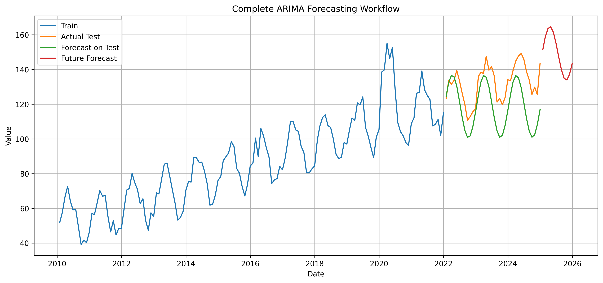
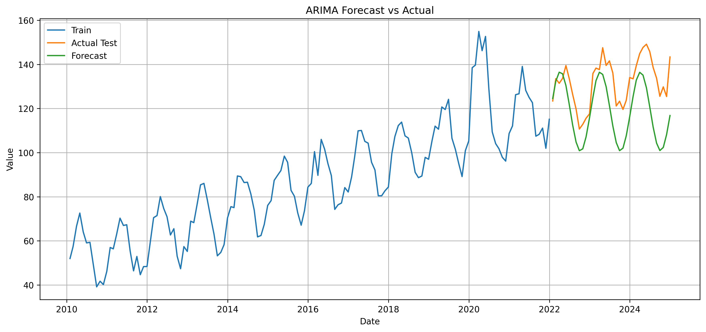
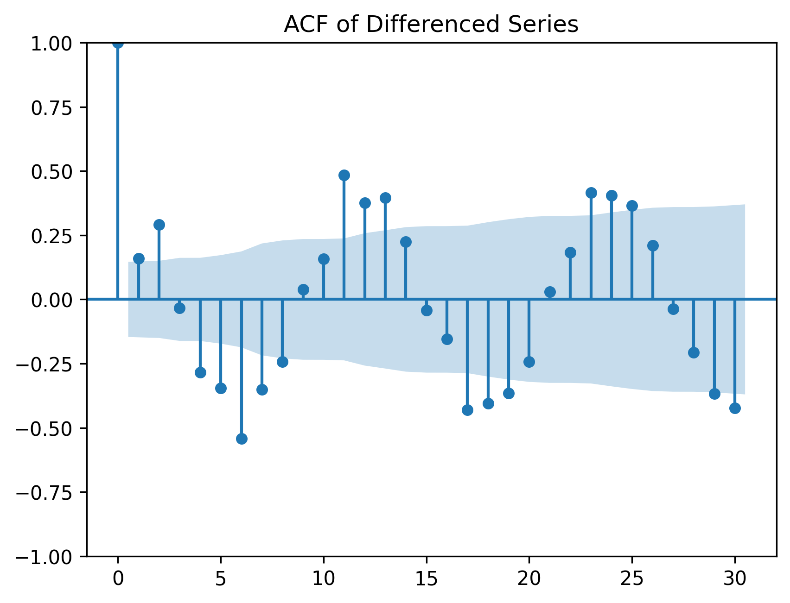
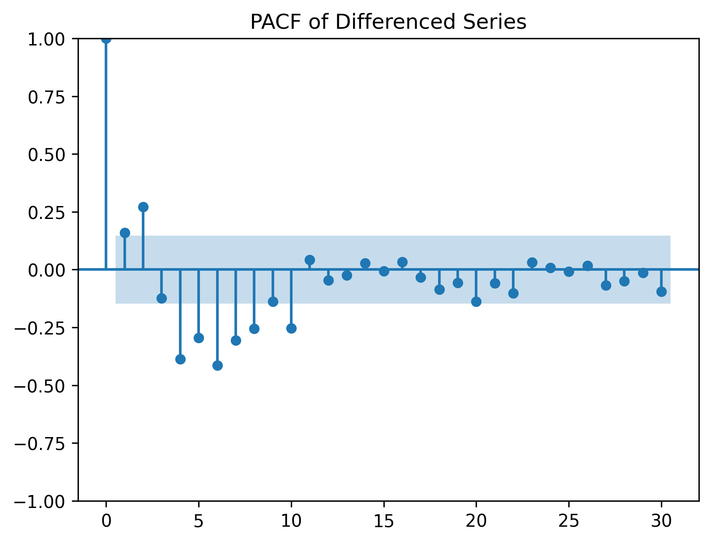

# Time Series Forecasting Studio

Interactive ARIMA-based time series forecasting app built with Python and Gradio, featuring visualization, model evaluation, and a live Hugging Face demo.

## Live Demo

[Try the app on Hugging Face](https://huggingface.co/spaces/dschechter27/time-series-forecasting-studio)

---

## Overview

Time Series Forecasting Studio is an interactive forecasting project for analyzing temporal datasets and generating future predictions with ARIMA.

The project allows users to:

- upload a CSV dataset
- select the date column and target value column
- configure ARIMA model parameters `(p, d, q)`
- generate forecasts for future time periods
- visualize historical data, test predictions, and future forecasts
- evaluate model performance using MAE and RMSE

This project was built as a hands-on exploration of:

- time series analysis  
- ARIMA modeling  
- forecasting workflows  
- data visualization  
- lightweight ML deployment with Gradio and Hugging Face Spaces  

---

## Features

- Interactive CSV upload
- Flexible date/value column selection
- ARIMA forecasting
- Forecast visualization
- Model evaluation with MAE and RMSE
- Trend summary generation
- Live deployment via Hugging Face Spaces

---

## Tech Stack

- Python
- pandas
- matplotlib
- statsmodels
- scikit-learn
- Gradio
- Hugging Face Spaces

---

## Repository Structure

```text
time-series-forecasting-studio/
├── app.py
├── requirements.txt
├── sample_data.csv
├── complete_forecasting_workflow.png
├── forecast_vs_actual.png
├── acf_plot.png
├── pacf_plot.png
└── time_series_analysis.ipynb
```

---

## How It Works

### 1. Upload a dataset
The user uploads a CSV containing a time column and a numeric target column.

### 2. Select columns
Because real datasets use different column names, the user chooses:
- the date column
- the value column to forecast

### 3. Fit an ARIMA model
The app trains an ARIMA model using user-selected `(p, d, q)` parameters.

### 4. Evaluate the model
The dataset is split into training and test sets, and the model is evaluated using:

- **MAE** — Mean Absolute Error  
- **RMSE** — Root Mean Squared Error  

### 5. Forecast the future
The fitted model is then used to forecast future values for a chosen number of periods.

### 6. Visualize results
The app displays a combined plot showing:

- training data  
- actual test data  
- forecast on the test set  
- future forecast  

---

## Example Forecast Visualizations

### Complete Forecasting Workflow


### Forecast vs Actual


---

## Time Series Diagnostics

To better understand the structure of the series, I also analyzed autocorrelation behavior using ACF and PACF plots on the differenced series.

### ACF of Differenced Series


### PACF of Differenced Series


These plots help reveal lag structure and support ARIMA-style modeling decisions.

---

## Running Locally

Clone the repository and install dependencies:

```bash
git clone https://github.com/dschechter27875/time-series-forecasting-studio.git
cd time-series-forecasting-studio
pip install -r requirements.txt
python app.py
```

Then open the local Gradio link in your browser.

---

## Hugging Face Deployment

This project is also deployed as a live Gradio app on Hugging Face Spaces:

https://huggingface.co/spaces/dschechter27/time-series-forecasting-studio

---

## What I Learned

Through this project, I gained hands-on experience with:

- preprocessing time series data  
- modeling trend, seasonality, and anomalies  
- fitting and evaluating ARIMA models  
- interpreting ACF and PACF diagnostics  
- building a user-facing forecasting interface  
- deploying a lightweight ML app with Hugging Face Spaces  

---

## Future Improvements

Potential next steps include:

- automatic ARIMA order selection  
- seasonal ARIMA support  
- downloadable forecast outputs  
- residual diagnostics  
- support for additional forecasting models  
- richer trend and anomaly summaries  

---

## Author

**David Schechter**  
Incoming MIT Class of 2030  
Interested in AI/ML, mathematics, and building technical projects that combine modeling, systems, and visualization.
